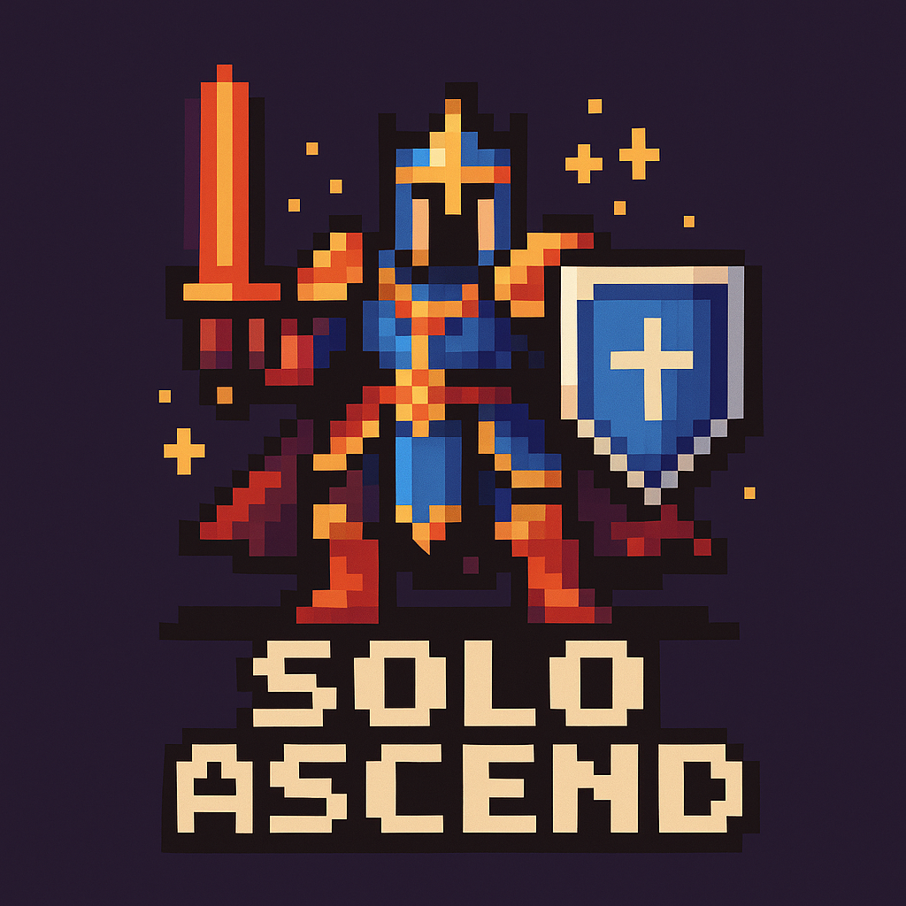

<p align="center">
  
</p>

# Solo Ascend

A fully on-chain hero forging game built on Ethereum with extensible Hook architecture, featuring an NFT hero system, forging mechanics, and token-bound accounts (TBA). Built with modern web technologies and blockchain integration.

## 🎯 Overview

Solo Ascend is a decentralized RPG game that combines NFT mechanics with daily progression systems. Players mint unique heroes, forge them daily using verifiable randomness, and watch them evolve through different stages. The game features a sophisticated hook system for extensibility and integrates with ERC-6551 for token-bound accounts.

### 🎮 Key Features

- **🛡️ Unique Heroes**: 5 distinct classes (Warrior, Mage, Archer, Rogue, Paladin) with randomized base attributes
- **⚔️ Daily Forging**: Daily progression system using Chainlink VRF for true randomness
- **🎭 Three Evolution Stages**: Heroes progress from Forging → Completed → Solo Leveling
- **💎 Quality System**: Four quality tiers (Silver, Gold, Rainbow, Mythic) with different rarities
- **🔧 Extensible Hooks**: Plugin architecture for custom game mechanics
- **💰 Token-Bound Accounts (TBA)**: Advanced NFT functionality with account abstraction (ERC-6551)
- **🎨 On-Chain Metadata**: Fully on-chain SVG rendering with dynamic attributes
- **🖥️ 3D Visualizations**: Interactive 3D effects using Three.js and React Three Fiber
- **🌍 Multi-language Support**: Internationalization with i18next

## 🏗️ Project Structure

- `apps/web`: Next.js frontend application.
- `apps/contracts`: Foundry smart contract project.
- `packages/*`: Shared configurations and utilities (if any).

## 🚀 Tech Stack

- **Monorepo Management**: [Turborepo](https://turbo.build/)
- **Package Manager**: [pnpm](https://pnpm.io/)
- **Frontend**: Next.js 15.4 (App Router), TypeScript, Tailwind CSS v4, Three.js, React Three Fiber, Zustand, Wagmi, Viem
- **Contracts**: Foundry, Solidity

## 📦 Getting Started

### Prerequisites

- [pnpm](https://pnpm.io/)
- [Foundry](https://book.getfoundry.sh/getting-started/installation) (for contracts)
- Node.js 18+

### Installation

```bash
pnpm install
```

### Development

Start the development server for the web app:

```bash
pnpm dev
```

### Build

Build all applications (web and contracts):

```bash
pnpm build
```

### Test

Run tests (Foundry tests):

```bash
pnpm test
```

## 📈 Roadmap

### Phase 1 (Current)

- ✅ Core hero and forging mechanics
- ✅ Basic effect system
- ✅ Oracle integration
- ✅ Hook architecture

### Phase 2 (Future)

- 📋 PvP combat system
- 📋 Governance token integration
- 📋 Community-driven content
- 📋 Advanced economic mechanisms

## 🤝 Contributing

We welcome contributions from the community!

1. Fork the repository
2. Create your feature branch (`git checkout -b feature/AmazingFeature`)
3. Commit your changes (`git commit -m 'Add some AmazingFeature'`)
4. Push to the branch (`git push origin feature/AmazingFeature`)
5. Open a Pull Request

## 📄 License

This project is proprietary software. All rights reserved.

## ⚠️ Disclaimer

This is experimental software. Use at your own risk. The contracts have been tested but may contain bugs or vulnerabilities. Always verify contracts and understand the risks before interacting with them.
